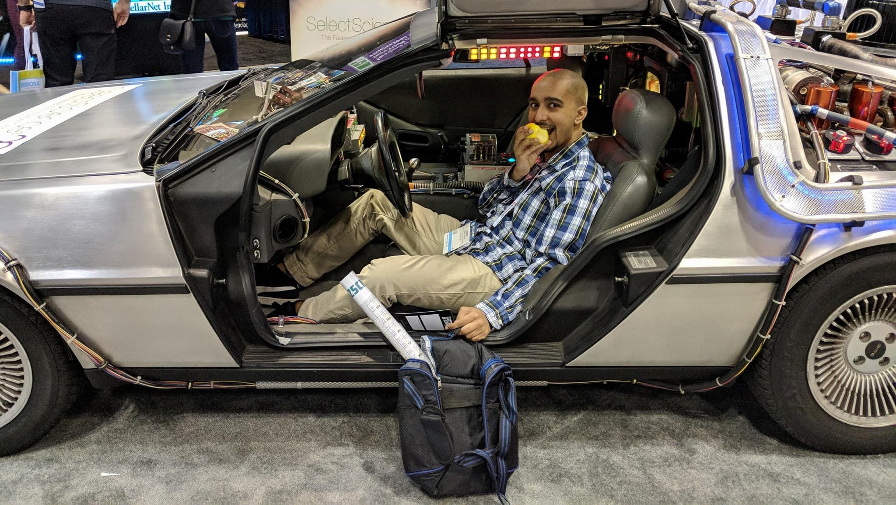

<picture>
  <source srcset="../logo.avif" type="image/avif">
  <source srcset="../logo.webp" type="image/webp">
  
</picture>

I have a wide array of experience, from using electrochemistry to understand neural systems at the
[Sombers Lab](https://www.somberslab.org/) in my undergrad at
[NC State](https://www.bme.ncsu.edu/) and to building tools that enable better data analysis
at [NeuroData](https://neurodata.io/) at [Johns Hopkins](https://www.bme.jhu.edu/)
via a [NIH Fellowship](https://researchtraining.nih.gov/programs/training-grants/T32-a)
These opportunities allowed me the pleasure to work on a wide variety of interesting and meaningful projects on a
daily basis.

When I'm not doing work, I like to read books and go on hikes!

## Research Interests

* Causal Inference
* Hypothesis Testing
* Neuroscience
* Genomics

## Education

* Ph.D. in [Biomedical Engineeering](https://www.bme.jhu.edu/), Johns Hopkins
* M.S.E. in [Biomedical Engineeering](https://www.bme.jhu.edu/), Johns Hopkins
* B.S. in [Biomedical Engineeering](http://catalog.ncsu.edu/undergraduate/engineering/biomedical/) & [Biology](https://bio.sciences.ncsu.edu/),  NC State